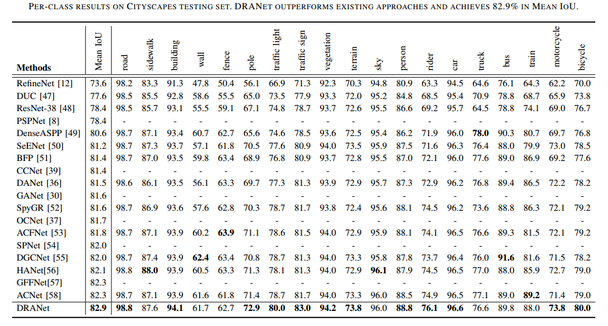

# [Dual Attention Network for Scene Segmentation(CVPR2019)](https://arxiv.org/pdf/1809.02983.pdf)
[Jun Fu](https://github.com/junfu1115/), [Jing Liu](http://www.nlpr.ia.ac.cn/iva/liujing/index.html), [Haijie Tian](https://github.com/tianhaijie), [Yong Li](http://www.foreverlee.net), Yongjun Bao, Zhiwei Fang,and Hanqing Lu 
## Introduction

We propose a Dual Attention Network (DANet) to adaptively integrate local features with their global dependencies based on the self-attention mechanism. And we achieve new state-of-the-art segmentation performance on three challenging scene segmentation datasets, i.e., Cityscapes, PASCAL Context and COCO Stuff-10k dataset.


## Cityscapes testing set result

We train our DANet-101 with only fine annotated data and submit our test results to the official evaluation server.



## Usage

1. Install pytorch 

  - The code is tested on python3.6 and official [Pytorch@commitfd25a2a](https://github.com/pytorch/pytorch/tree/fd25a2a86c6afa93c7062781d013ad5f41e0504b#from-source), please install PyTorch from source.
  - The code is modified from [PyTorch-Encoding](https://github.com/zhanghang1989/PyTorch-Encoding). 
  
2. Clone the repository:

   ```shell
   git clone https://github.com/junfu1115/DANet.git 
   cd DANet 
   python setup.py install
   ```
   
3. Dataset

  - Download the [Cityscapes](https://www.cityscapes-dataset.com/) dataset and convert the dataset to [19 categories](https://github.com/mcordts/cityscapesScripts/blob/master/cityscapesscripts/helpers/labels.py). 
  - Please put dataset in folder `./datasets`

4 . Evaluation

  - Download trained model [DANet101](https://drive.google.com/open?id=1XmpFEF-tbPH0Rmv4eKRxYJngr3pTbj6p) and put it in folder `./danet/cityscapes/model`
  - Evaluation code is in folder `./danet/cityscapes`
  - `cd danet`

  - For single scale testing, please run:
  
   ```shell
   CUDA_VISIBLE_DEVICES=0,1,2,3 python test.py --dataset cityscapes --model danet --resume-dir cityscapes/model --base-size 2048 --crop-size 768 --workers 1 --backbone resnet101 --multi-grid --multi-dilation 4 8 16 --eval
   ```
   
  - For multi-scale testing, please run:
  
   ```shell
   CUDA_VISIBLE_DEVICES=0,1,2,3 python test.py --dataset cityscapes --model danet --resume-dir cityscapes/model --base-size 2048 --crop-size 1024 --workers 1 --backbone resnet101 --multi-grid --multi-dilation 4 8 16 --eval --multi-scales
   ```  
   
  - If you want to visualize the result of DAN-101, you can run:
 
   ```shell
   CUDA_VISIBLE_DEVICES=0,1,2,3 python test.py --dataset cityscapes --model danet --resume-dir cityscapes/model --base-size 2048 --crop-size 768 --workers 1 --backbone resnet101 --multi-grid --multi-dilation 4 8 16
   ```
   
5. Evaluation Result:

   The expected scores will show as follows:
   
   (single scale testing denotes as 'ss' and multiple scale testing denotes as 'ms')
   
   DANet101 on cityscapes val set (mIoU/pAcc): **79.93/95.97** (ss) and **81.49/96.41** (ms)


6. Training:

  - Training code is in folder `./danet/cityscapes`
  - `cd danet`
  
   You can reproduce our result by run:

  ```shell
   CUDA_VISIBLE_DEVICES=0,1,2,3 python train.py --dataset cityscapes --model  danet --backbone resnet101 --checkname danet101  --base-size 1024 --crop-size 768 --epochs 240 --batch-size 8 --lr 0.003 --workers 2 --multi-grid --multi-dilation 4 8 16
   ```
 
   Note that: We adopt multiple losses in end of the network for better training. 
   

## Citation
If DANet is useful for your research, please consider citing:
```
@inproceedings{fu2019dual,
  title={Dual attention network for scene segmentation},
  author={Fu, Jun and Liu, Jing and Tian, Haijie and Li, Yong and Bao, Yongjun and Fang, Zhiwei and Lu, Hanqing},
  booktitle={Proceedings of the IEEE Conference on Computer Vision and Pattern Recognition},
  pages={3146--3154},
  year={2019}
}
```
## Acknowledgement
Thanks [PyTorch-Encoding](https://github.com/zhanghang1989/PyTorch-Encoding), especially the Synchronized BN!
